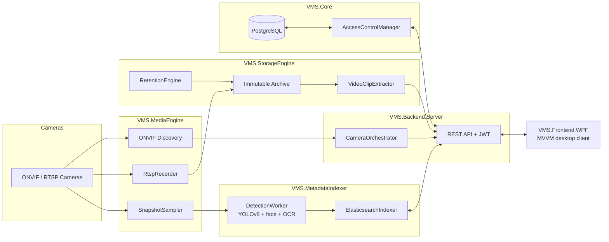

<div align="center">

# 🎥 VMS — Enterprise Video Management System

**ONVIF/RTSP capture · offline AI object & face detection · Elasticsearch search · role-based REST API · WPF desktop client**

Built solo, end-to-end, in C#/.NET — validated live against **3 real ONVIF cameras** running simultaneously.

[🇷🇺 Читать на русском](README.ru.md) · [📖 Full technical docs](readme_eng.md) · [📄 Полная документация (RU)](readme_rus.md)


</div>

---

## What this is

A from-scratch **Video Management System** — the kind of software that normally ships from a
company like Hikvision, Milestone, or Genetec — covering the entire stack a real product needs:
camera discovery and recording, a write-protected archive with retention, offline AI analytics,
a searchable index, a secured API, and a desktop client operators actually watch all day.

It's not a CRUD demo. It talks to real cameras over a hand-rolled ONVIF/WS-Security SOAP client,
supervises per-camera `ffmpeg` subprocesses with auto-restart, runs an offline YOLOv8 detection
pipeline, embeds and matches faces by cosine similarity, and enforces one shared RBAC rule table
on both the server and the WPF client so they can never disagree about who's allowed to do what.

> Part of the implementation was built with the help of **Claude Code** (AI pair-programming) —
> architecture, design decisions, and review were human-driven throughout.

## Highlights

| | |
|---|---|
| 🎥 **Live multi-camera grid** | GPU-accelerated decode (LibVLC/NVDEC), Auto/1×1/2×2/3×3/4×4 layouts, one-click fullscreen expand per tile |
| 🧠 **Offline AI pipeline** | YOLOv8 object detection, face embedding + known-person matching, best-effort license-plate OCR — 100% local, no cloud API calls |
| 🔍 **Smart search** | Elasticsearch-backed — free text, color + object type ("red car"), a person's name, or a plate number |
| 🔐 **5-tier RBAC** | `Guard → Viewer → Operator → Admin → SuperAdmin`, one rule table shared by the server and the WPF client — UI gating can never drift from server-side authorization |
| 🗄️ **Immutable archive** | Windows-ACL write protection against accidental or malicious deletion, automatic per-camera retention purge |
| 🧱 **Zero-crash design** | One supervised `ffmpeg` process per camera (crash isolation) + a Windows Job Object so a server crash can't orphan child processes |
| 🌍 **Full localization** | RU/EN/TM, swappable at runtime — every single UI string goes through the localization system, none hardcoded |
| ✅ **Validated on real hardware** | 3 ONVIF cameras, independent recording/detection, not a mocked demo |

## Architecture



Six independently-owned projects, data flowing in one direction — see the
[full architecture writeup](readme_eng.md#architecture) for every module's internals and the
reasoning behind each key design decision (fragmented MP4, process-per-camera isolation, the
`?access_token=` clip-auth workaround for LibVLC, etc).

## Tech stack

- **Backend**: ASP.NET Core Minimal API, EF Core / PostgreSQL, JWT auth, BCrypt
- **Desktop client**: WPF, MVVM (CommunityToolkit.Mvvm source generators), LibVLCSharp
- **AI / ML**: YOLOv8 via ONNX Runtime, OpenCvSharp (Haar cascade + SFace face embedding), Tesseract OCR
- **Media**: FFmpeg (supervised child processes), ONVIF (hand-rolled WS-Security SOAP client)
- **Search**: Elasticsearch
- **Infra**: Docker Compose, Inno Setup installer
- **Tests**: xUnit

## Quick start

```powershell
docker compose up -d                 # PostgreSQL + Elasticsearch
.\scripts\setup-tools.ps1            # one-time: ffmpeg, YOLO ONNX export, face models
dotnet ef database update --project VMS.Core --startup-project VMS.Core
dotnet run --project VMS.Backend.Server --urls http://localhost:5080
dotnet run --project VMS.Frontend.WPF
```

A test camera is configured via a gitignored `VMS.Backend.Server/appsettings.local.json` — see the
[full docs](readme_eng.md#quick-start) for its exact shape and for the complete REST API table,
RBAC permission matrix, and the honestly-documented list of known MVP limitations.

## Project layout

```
VMS.Core/              domain models, RBAC, auth, EF Core DbContext
VMS.MediaEngine/       ONVIF client, stream recording, AI snapshot sampling
VMS.StorageEngine/     retention, immutable archive, clip extraction
VMS.MetadataIndexer/   YOLO detection, Elasticsearch indexing/search
VMS.Backend.Server/    ASP.NET Core Minimal API + background orchestration
VMS.Frontend.WPF/      MVVM desktop client (LibVLCSharp)
VMS.Core.Tests/        unit tests (RBAC, auth)
```

## Documentation

This page is the portfolio front door. For the complete milestone breakdown, full REST API
reference, RBAC permission matrix, and known limitations:

- 🇬🇧 **[readme_eng.md](readme_eng.md)** — complete technical documentation
- 🇷🇺 **[readme_rus.md](readme_rus.md)** — полная техническая документация

## Contact

- GitHub: [@anvar-sharipov](https://github.com/anvar-sharipov)
- Email: anvar7235@gmail.com
