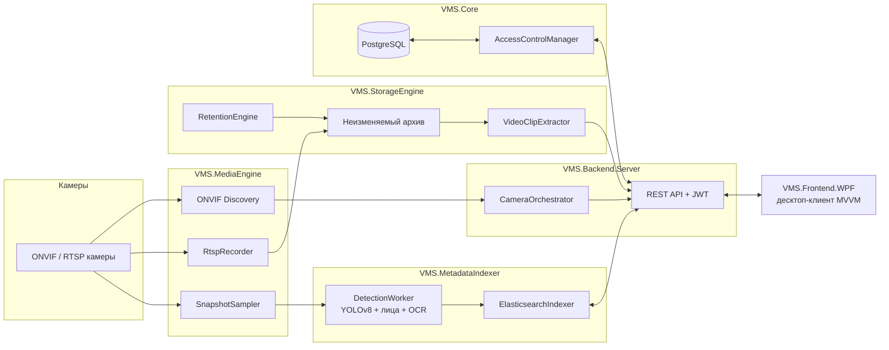

<div align="center">

# 🎥 VMS — Корпоративная система видеонаблюдения

**ONVIF/RTSP-захват · офлайн ИИ-детекция объектов и лиц · поиск через Elasticsearch · REST API с ролевой моделью · десктоп-клиент на WPF**

Разработана в одиночку, от начала до конца, на C#/.NET — проверена вживую на **3 реальных ONVIF-камерах**, работающих одновременно.

[🇬🇧 Read in English](README.md) · [📖 Полная техническая документация](readme_rus.md) · [📄 Full docs (EN)](readme_eng.md)


</div>

---

## Что это

Система видеонаблюдения (VMS), написанная с нуля — такой продукт в норме продают компании вроде
Hikvision, Milestone или Genetec — и закрывающая весь стек, нужный реальному продукту: обнаружение
и запись камер, защищённый от удаления архив с retention-политикой, офлайн ИИ-аналитика,
поисковый индекс, защищённое API и десктоп-клиент, в который оператор смотрит весь день.

Это не CRUD-поделка. Система общается с реальными камерами через написанный с нуля
ONVIF/WS-Security SOAP-клиент, следит за процессами `ffmpeg` по одному на камеру с
авто-перезапуском, прогоняет офлайн-пайплайн детекции YOLOv8, считает эмбеддинги лиц и сравнивает
их по косинусному сходству, и использует одну общую таблицу правил RBAC сразу на сервере и в
WPF-клиенте — поэтому они физически не могут разойтись в том, кому что разрешено.

> Часть реализации велась с помощью **Claude Code** (AI-ассистент для написания кода) —
> архитектура, решения и финальная проверка на всех этапах оставались за человеком.

## Главное

| | |
|---|---|
| 🎥 **Живая сетка камер** | Аппаратное декодирование (LibVLC/NVDEC), раскладки Авто/1×1/2×2/3×3/4×4, разворот любой плитки в отдельное окно в один клик |
| 🧠 **Офлайн ИИ-пайплайн** | Детекция объектов YOLOv8, эмбеддинг лиц + сопоставление с известными людьми, распознавание номеров (best-effort OCR) — всё локально, без облачных API |
| 🔍 **Умный поиск** | На Elasticsearch — свободный текст, цвет + тип объекта («red car»), имя человека или номер машины |
| 🔐 **RBAC из 5 ролей** | `Guard → Viewer → Operator → Admin → SuperAdmin`, одна таблица правил и на сервере, и в WPF-клиенте — интерфейс не может разойтись с серверной авторизацией |
| 🗄️ **Неизменяемый архив** | Защита от удаления через Windows ACL, автоматическая очистка по retention-политике для каждой камеры |
| 🧱 **Архитектура без падений** | Супервизируемый процесс `ffmpeg` на каждую камеру (изоляция сбоев) + Windows Job Object, чтобы падение сервера не оставляло процессы-сироты |
| 🌍 **Полная локализация** | RU/EN/TM, переключение на лету — вообще весь текст интерфейса идёт через систему локализации, ни одной строки в коде |
| ✅ **Проверено на реальном железе** | 3 ONVIF-камеры, независимая запись/детекция, не имитация на моках |

## Архитектура



Шесть проектов, каждый со своей зоной ответственности, данные идут в одном направлении — всё
устройство каждого модуля и обоснование ключевых решений (фрагментированный MP4, изоляция по
процессу на камеру, обход `?access_token=` для авторизации клипов в LibVLC и т.д.) — в
[полном описании архитектуры](readme_rus.md#архитектура).

## Технологии

- **Backend**: ASP.NET Core Minimal API, EF Core / PostgreSQL, JWT-аутентификация, BCrypt
- **Десктоп-клиент**: WPF, MVVM (генераторы CommunityToolkit.Mvvm), LibVLCSharp
- **ИИ / ML**: YOLOv8 через ONNX Runtime, OpenCvSharp (каскад Хаара + эмбеддинг лиц SFace), Tesseract OCR
- **Медиа**: FFmpeg (супервизируемые дочерние процессы), ONVIF (SOAP-клиент собственной разработки)
- **Поиск**: Elasticsearch
- **Инфраструктура**: Docker Compose, инсталлятор на Inno Setup
- **Тесты**: xUnit

## Быстрый старт

```powershell
docker compose up -d                 # PostgreSQL + Elasticsearch
.\scripts\setup-tools.ps1            # разово: ffmpeg, экспорт YOLO в ONNX, модели для лиц
dotnet ef database update --project VMS.Core --startup-project VMS.Core
dotnet run --project VMS.Backend.Server --urls http://localhost:5080
dotnet run --project VMS.Frontend.WPF
```

Тестовая камера настраивается через гитигнорируемый
`VMS.Backend.Server/appsettings.local.json` — точный формат, полная таблица REST API, матрица
прав RBAC и честно задокументированный список ограничений MVP — в
[полной документации](readme_rus.md#быстрый-старт).

## Структура проекта

```
VMS.Core/              домен, RBAC, аутентификация, EF Core DbContext
VMS.MediaEngine/       ONVIF-клиент, запись потоков, снапшоты для ИИ
VMS.StorageEngine/     retention, неизменяемый архив, вырезание клипов
VMS.MetadataIndexer/   детекция YOLO, индексация/поиск в Elasticsearch
VMS.Backend.Server/    ASP.NET Core Minimal API + фоновая оркестрация
VMS.Frontend.WPF/      десктоп-клиент MVVM (LibVLCSharp)
VMS.Core.Tests/        юнит-тесты (RBAC, аутентификация)
```

## Документация

Эта страница — портфолио-витрина. Полная разбивка по этапам, вся таблица REST API, матрица прав
RBAC и список известных ограничений:

- 🇷🇺 **[readme_rus.md](readme_rus.md)** — полная техническая документация
- 🇬🇧 **[readme_eng.md](readme_eng.md)** — complete technical documentation

## Контакты

- GitHub: [@anvar-sharipov](https://github.com/anvar-sharipov)
- Email: anvar7235@gmail.com
